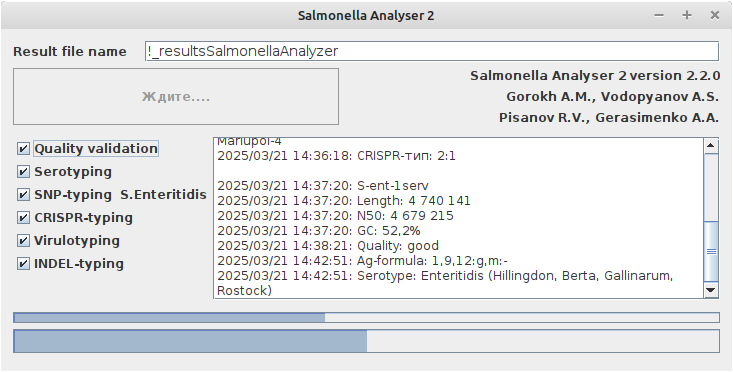
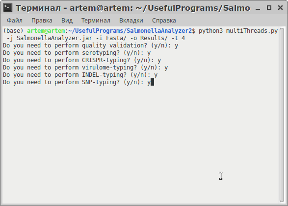

## Content

* [About](#info)
* [Installation](#install)
* [How to run](#run)
* [For citation](#cite)
***
## Содержание 
* [Описание](#info-ru)
* [Установка](#install-ru)
* [Запуск программы](#run-ru)
* [Для цитирования](#cite-ru)
  
## <a id="info">**About**</a>
Salmonella Analyzer 2 is the program created for _Salmonella enterica_ genomes analysis in order to determine some characteristics of samples:
- quality of assemble;
- serotype;
- pathogenicity factors;
- CRISPR-type;
- INDEL-type;
- phylogenetics by marker SNPs (only for _Salmonella enterica_ Enteritidis).
***
## <a id="install">**Installation**</a>
In the beginning, unzip the downloaded archive and run SalmonellaAnalyzer2 file.bat, if you have Windows OS or SalmonellaAnalyzer2.jar in Linux OS and macOS.
***
##  <a id="run">**How to run**</a>
### GUI version

#### Run
1. Fill the "Result file name" with a name of the final results.
2. Select options you need for analysis.
3. Select sequences using the "Select files and run" button. The analyzed data files should be in ___.fasta___ or ___.fa___ format.
4. The analysis will start automatically. Below, you can see the scale of the analysis progress of both an individual sample and their totality.
#### Results
During the operation, the intermediate results are displayed in the program window. After completion of the work, the final table with the previously selected name will be stored in the folder where the sequences selected for analysis were located.
***
### Console version

To run the program in multithreaded mode and get the result in ___.json___ format, run the script _multiThreads.py_ from the working directory in a terminal or command line 
#### Example run
```bash
python3 multiThreads.py -j SalmonellaAnalyzer2.jar -i Fasta -o Results -t 8
```
#### Arguments
- **-j** path to program file
- **-i** path to input directory
-  **-o** path to output directory
- **-t** number of threads
  
After you need answer some questions, if you need to get quality validation, serotyping, CRISPR-, INDEL-, SNP or virulome-typing by choosing ___y___ or ___n___ in terminal.
#### Results
The results you can see in directory you choosed by _-o_ parameter.
***
## <a id="cite">**For citation:**</a>
_А.М. Горох, А.А. Герасименко, Е.В. Здесенко, Р.В. Писанов, А.С. Водопьянов. Изучение генетических особенностей штаммов _Salmonella enterica_, изолированных в Ростовской области в 2022 году // Современные проблемы эпидемиологии, микробиологии и гигиены : Материалы XV Всероссийской научно-практической конференции молодых ученых и специалистов Роспотребнадзора. – Н. Новгород, 2023. – С. 48._
[See the work here](https://www.nniiem.ru/file/publicat/2023/sbxv2023.pdf#page=48)
***
## <a id="info-ru">**Описание**</a>
Salmonella Analyzer 2 - программа, созданная для анализа геномов  _Salmonella enterica_, служащая для определения следующих характеристик исследуемых штаммов:
- качества сборки геномов;
- серотипа;
- генов патогенности;
- CRISPR-типа;
- INDEL-типа;
- филогенетики по маркерным SNP (только для штаммов _Salmonella enterica_ Enteritidis).
***
## <a id="install-ru">**Установка**</a>
Для запуска программы распакуйте скачанный архив и запустите файл SalmonellaAnalyzer2.bat, если у вас операционная система Windows или SalmonellaAnalyzer2.jar в операционной систиме Linux, macOS.
***
##  <a id="run-ru">**Запуск**</a>
### Графический интерфейс
#### Запуск
1. Заполните поле '"Result file name" для наименования файла с итоговыми результатами. 
2. Выберите интересующие опции для анализа.
3. Выберите исследуемые последовательности по кнопке "Select files and run". Данными служат файлы ___.fasta___ или  ___.fa___ формата.
4. Анализ начнется автоматически. Ниже можно будет увидеть шкалу прогресса анализа как отдельной пробы, так и их совокупности.
#### Результаты
В ходе выполнения программы, промежуточные результаты отображаются в окне программы. После завершения работы, итоговая таблица с выбранным ранее именем будем храниться в папке, где находились выбранные для анализа последовательности. 
***
### Консольный интерфейс
Для запуска программы в многопоточном режиме и получения результата в ___.json___ формате, запустите из рабочей директории в терминале или командной строке скрипт _multiThreads.py_
#### Пример запуска
```bash
python3 multiThreads.py -j SalmonellaAnalyzer2.jar -i Fasta -o Results -t 8
```
#### Необходимые аргументы
- **-j** путь до исполняемой программы (SalmonellaAnalyzer.jar)
- **-i** путь до папки с пробами
-  **-o** путь до папки, где будут храниться результаты
- **-t** число выделяемых потоков для работы

После запуска вышеприведенного скрипта, ответьте на предложенные вопросы, которые позволят выбрать, какие характеристики геномов вы хотите исследовать. Если вы хотите включить или отключить какую-либо из предложенных опций, ответьте да (___y___) или нет (___n___).
#### Результаты
Итоговые файлы в формате ___.json___ вы сможете увидеть в папке, которую вы выбрали через аргумент _-o_.
***
## <a id="cite-ru">**Для цитирования:**</a>
_А.М. Горох, А.А. Герасименко, Е.В. Здесенко, Р.В. Писанов, А.С. Водопьянов. Изучение генетических особенностей штаммов _Salmonella enterica_, изолированных в Ростовской области в 2022 году // Современные проблемы эпидемиологии, микробиологии и гигиены : Материалы XV Всероссийской научно-практической конференции молодых ученых и специалистов Роспотребнадзора. – Н. Новгород, 2023. – С. 48._
[Посмотреть публикацию](https://www.nniiem.ru/file/publicat/2023/sbxv2023.pdf#page=48)